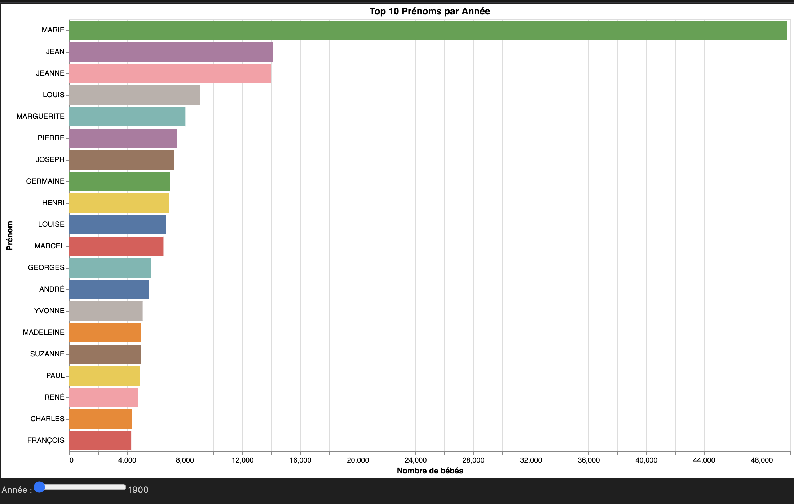
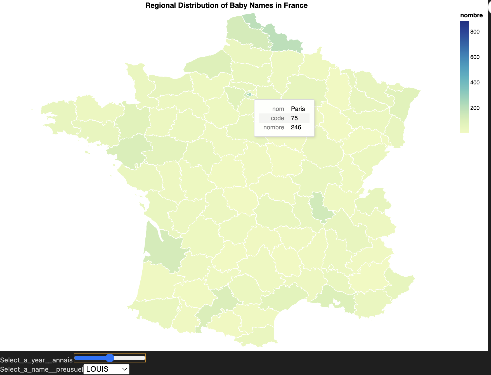
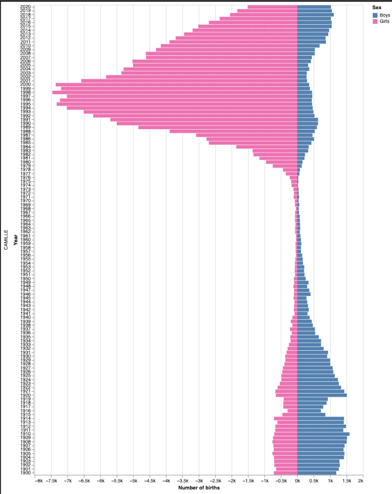

# Baby Names Mini Project - Groupe C

## Project guidelines 

In this mini-project, we will be working with a data set of baby names in France. It contains the list of all baby names registered in France, year by year, from 1900 through 2020. There are two data sets: one aggregated to the national level, and another with data by department. Your goal is to create 3 different visualizations around these data, each focussed on answering different kinds of questions about the data:

### Visualization 1: 
How do baby names evolve over time? Are there names that have consistently remained popular or unpopular? Are there some that have were suddenly or briefly popular or unpopular? Are there trends in time?

### Visualization 2: 
Is there a regional effect in the data? Are some names more popular in some regions? Are popular names generally popular across the whole country?

### Visualization 3:
Are there gender effects in the data? Does popularity of names given to both sexes evolve consistently? (Note: this data set treats sex as binary; this is a simplification that carries into this assignment but does not generally hold.)
This assignment consists of several parts: in the first part, you will sketch design alternatives for different visualizations that can help address each set of questions. In the second part, you will implement that visualization using one of the tools from the class lab assignments. In the third part, you will refine these solutions.

## Project content 

To do this project, I used Python and created the visualizations with Altair.

In this repository, you'll find two Jupyter notebooks that generates the three visualizations :

- **Chloropleth maps in Altair.ipynb** is the initial implementation.
- **Baby_names_final.ipynb** is the final notebook with the refined implementation that should be run.

Below are the resulting visualizations:

1. Visualization 1: Baby Name Evolution Over Time

2. Visualisation 2 : Regional Distribution of Baby Names in France

3. Visualisation 3 : Popularity of Baby Names in France by Gender

## Author 

Nour Nounah
